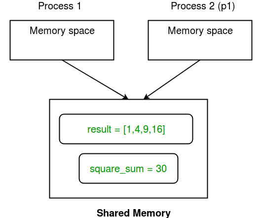
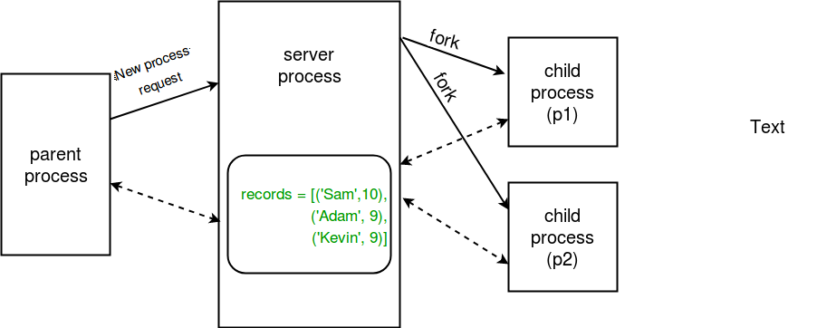
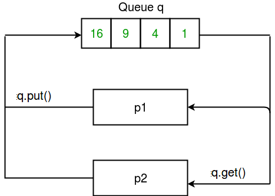
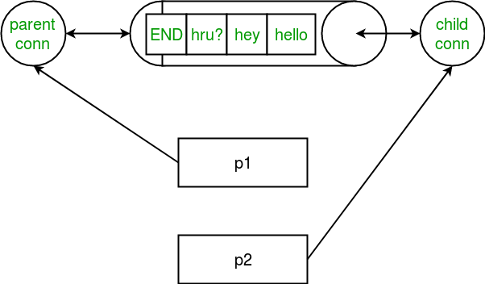

## Multiprocessing
- Multiprocessing refers to the ability of a system to support more than one processor at the same time.

A multiprocessing system can have:
- multiprocessor, i.e. a computer with more than one central processor.
- multi-core processor, i.e. a single computing component with two or more independent actual processing units (called “cores”).


Multiprocessing is a Python module that enables the creation, management, and coordination of multiple processes to achieve parallelism. **Unlike threading, which involves multiple threads running within a single process and sharing the same memory space (and thus subject to the Global Interpreter Lock or GIL in Python), multiprocessing allows Python programs to use multiple processes, each with its own memory space, to achieve true parallelism.**
-  Each process runs independently and can execute its own code concurrently with other processes.
- Each process has its own memory space, global interpreter lock (GIL), and resources, allowing for true parallel execution of code.
- Multiprocessing provides mechanisms for communication and synchronization between processes, such as shared memory, message passing, and synchronization primitives like locks, semaphores, and queues.
- **Multiprocessing enables Python programs to leverage multiple CPU cores and processors, making it suitable for CPU-bound tasks that can benefit from parallel execution.**
- multiprocessing provides fault isolation. If one process encounters an error or crashes, it does not affect other processes, making the overall program more robust.


# Communication between Processes
 In multiprocessing, any newly created process will do following:  
run independently  
have their own memory space.


Shared memory : multiprocessing module provides Array and Value objects to share data between processes.  
- Array: a **ctypes** array allocated from shared memory.  
- Value: a **ctypes** object allocated from shared memory.

```python
import multiprocessing 

def square_list(mylist, result, square_sum): 
	""" 
	function to square a given list 
	"""
	# append squares of mylist to result array 
	for idx, num in enumerate(mylist): 
		result[idx] = num * num 

	# square_sum value 
	square_sum.value = sum(result) 

	# print result Array 
	print("Result(in process p1): {}".format(result[:])) 

	# print square_sum Value 
	print("Sum of squares(in process p1): {}".format(square_sum.value)) 

if __name__ == "__main__": 
	# input list 
	mylist = [1,2,3,4] 

	# creating Array of int data type with space for 4 integers 
	result = multiprocessing.Array('i', 4) 

	# creating Value of int data type 
	square_sum = multiprocessing.Value('i') 

	# creating new process 
	p1 = multiprocessing.Process(target=square_list, args=(mylist, result, square_sum)) 

	# starting process 
	p1.start() 

	# wait until the process is finished 
	p1.join() 

	# print result array 
	print("Result(in main program): {}".format(result[:])) 

	# print square_sum Value 
	print("Sum of squares(in main program): {}".format(square_sum.value)) 

```

`result = multiprocessing.Array('i', 4)`
1arg -> i - interger whereas 'd' stands for float data type
2arg -> size of array.

`square_sum = multiprocessing.Value('i')`  
`square_sum = multiprocessing.Value('i', 10)`  
similar as above first arg is data type and second if pass would be initial value.

- Secondly, we pass result and square_sum as arguments while creating Process object.
- result array elements are given a value by specifying index of array element.
- square_sum is given a value by using its value attribute:
`square_sum.value = sum(result)`  

Above process has the shared memory which can be shown by below diagram.



# Server Process

Whenever a python program starts, a server process is also started. From there on, whenever a new process is needed, the parent process connects to the server and requests it to fork a new process. A server process can hold Python objects and allows other processes to manipulate them using proxies. multiprocessing module provides a Manager class which controls a server process. Hence, managers provide a way to create data that can be shared between different processes.

`Server process managers are more flexible than using shared memory objects because they can be made to support arbitrary object types like lists, dictionaries, Queue, Value, Array, etc. Also, a single manager can be shared by processes on different computers over a network. They are, however, slower than using shared memory.`

```python
import multiprocessing 

def print_records(records): 
	""" 
	function to print record(tuples) in records(list) 
	"""
	for record in records: 
		print("Name: {0}\nScore: {1}\n".format(record[0], record[1])) 

def insert_record(record, records): 
	""" 
	function to add a new record to records(list) 
	"""
	records.append(record) 
	print("New record added!\n") 

if __name__ == '__main__': 
	with multiprocessing.Manager() as manager: 
		# creating a list in server process memory 
		records = manager.list([('Sam', 10), ('Adam', 9), ('Kevin',9)]) 
		# new record to be inserted in records 
		new_record = ('Jeff', 8) 

		# creating new processes 
		p1 = multiprocessing.Process(target=insert_record, args=(new_record, records)) 
		p2 = multiprocessing.Process(target=print_records, args=(records,)) 

		# running process p1 to insert new record 
		p1.start() 
		p1.join() 

		# running process p2 to print records 
		p2.start() 
		p2.join() 

```




# Multiprocessing supports two types of communication channel between processes.
- Queue  
A simple way to communicate between process with multiprocessing is to use a Queue to pass messages back and forth. Any Python object can pass through a Queue. Note: The multiprocessing.Queue class is a near clone of queue.Queue.



- Pipe  
A pipe can have only two endpoints. Hence, it is preferred over queue when only two-way communication is required. multiprocessing module provides Pipe() function which returns a pair of connection objects connected by a pipe. The two connection objects returned by Pipe() represent the two ends of the pipe. Each connection object has send() and recv() methods (among others)



Note - 
**Data in a pipe may become corrupted if two processes (or threads) try to read from or write to the same end of the pipe at the same time. Of course, there is no risk of corruption from processes using different ends of the pipe at the same time. Also note that Queues do proper synchronization between processes, at the expense of more complexity. Hence, queues are said to be thread and process safe!**

# Pool and Shared Resource

10000 withdraw and 10000 deposit transactions are carried out with initial balance as 100. The expected final balance is 100 but what we get in 10 iterations of perform_transactions function is some different values. This happens due to concurrent access of processes to the shared data balance. This unpredictability in balance value is nothing but race condition.


# Using Locks

Multiprocessing module provides a Lock class to deal with the race conditions.  
Lock is implemented using a Semaphore object provided by the Operating System.  

**A semaphore is a synchronization object that controls access by multiple processes to a common resource in a parallel programming environment. It is simply a value in a designated place in operating system (or kernel) storage that each process can check and then change. Depending on the value that is found, the process can use the resource or will find that it is already in use and must wait for some period before trying again. Semaphores can be binary (0 or 1) or can have additional values. Typically, a process using semaphores checks the value and then, if it using the resource, changes the value to reflect this so that subsequent semaphore users will know to wait.**

critical section of target function, we apply lock using `lock.acquire()` method. As soon as a lock is acquired, no other process can access its critical section until the lock is released using `lock.release()` method.

```
lock.acquire()
balance.value = balance.value - 1
lock.release()
```

# Pooling between processes

There are a few arguments for gaining more control over offloading of task. These are:  
- processes: specify the number of worker processes.  
- maxtasksperchild: specify the maximum number of task to be assigned per child.  
All the processes in a pool can be made to perform some initialization using these arguments:  
- initializer: specify an initialization function for worker processes.  
- initargs: arguments to be passed to initializer.  
Now, in order to perform some task, we have to map it to some function. In the example above, we map mylist to square function. As a result, the contents of mylist and definition of square will be distributed among the cores.