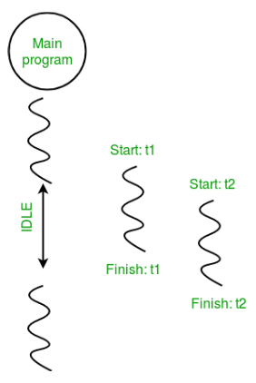

## Multi Threading in Python

- thread is simply a subset of a process!
- In simple words, a thread is a sequence of such instructions within a program that can be executed independently of other code.

# A thread contains all this information in a Thread Control Block (TCB)
- Thread Identifier: Unique id (TID) is assigned to every new thread
- Stack pointer: Points to the thread’s stack in the process. The stack contains the local variables under the thread’s scope.
- Program counter: a register that stores the address of the instruction currently being executed by a thread.
- Thread state: can be running, ready, waiting, starting, or done.
- Thread’s register set: registers assigned to thread for computations.
- Parent process Pointer: A pointer to the Process control block (PCB) of the process that the thread lives on.


- **Multithreading is defined as the ability of a processor to execute multiple threads concurrently**. 
In a simple, single-core CPU, it is achieved using frequent switching between threads. This is termed **context switching**. 
- In context switching, the state of a thread is saved and the state of another thread is loaded whenever any interrupt (due to I/O or manually set) takes place. Context switching takes place so frequently that all the threads appear to be running parallelly (this is termed multitasking).

**In simple words when there is a timeout(There is time taken) in any thread then another thread is taken to run. Code in the folder show the same.**

- Import module.
```python
import threading
```

- Create a Thread
To create a new thread, we create an object of the Thread class. It takes the ‘target’ and ‘args’ as the parameters. The target is the function to be executed by the thread whereas the args is the arguments to be passed to the target function.

```python
t1 = threading.Thread(target, args)
t2 = threading.Thread(target, args)
```

- Start a Thread
To start a thread, we use the start() method of the Thread class.
```python
t1.start()
t2.start()
```

- End the thread Execution
Once the threads start, the current program (you can think of it like a main thread) also keeps on executing. In order to stop the execution of the current program until a thread is complete, we use the join() method.
```python
t1.join()
t2.join()
```

```python
import threading


def print_cube(num):
	print("Cube: {}" .format(num * num * num))


def print_square(num):
	print("Square: {}" .format(num * num))


if __name__ =="__main__":
	t1 = threading.Thread(target=print_square, args=(10,))
	t2 = threading.Thread(target=print_cube, args=(10,))

	t1.start()
	t2.start()

	t1.join()
	t2.join()

	print("Done!")

```

[Simple Thread Implementation](simpleThread.py)   
[Loop Thread Implementation](thread.py) 




# Python ThreadPool
- A thread pool is a collection of threads that are created in advance and can be reused to execute multiple tasks
- *concurrent.futures module* provides a ThreadPoolExecutor class that makes it easy to create and manage a thread pool.
- We create a theradpool executor with a max size.
- Submit tasks to it and they will be executed.
- We use shutdown method to wait for all tasks to complete before the main thread continues.  

Note: **Do not confuse thread pool as a Process itself. Processor could have n number of threads whereas threadpool is a collection of countable threads which helps in keeping memory in check and prevent overuse of the resources.**

[Thread Pool](threadPool.py)

Try to play with the code.  You can change the number of threads in the pool or add more tasks.

Observe the thread id when you are running simple tasks without timeouts and when you are running the tasks with more timeout.
It will help you understand better.

# Synchronization between threads
*Thread synchronization* is defined as a mechanism which ensures that two or more concurrent threads do not simultaneously execute some particular program segment known as critical section.

*Critical section* refers to the parts of the program where the shared resource is accessed.

This could lead to *Race condition*.
*Race Condition* - Different Thread try to make change in a single shared resource at the same time.
It leads to unexpected output.

[Race Condition](raceCondition.py)


So  we need to ensure that only one thread accesses the critical section at a time. To prevent the race condition.

[Prevent Race condition](lockRelease.py)

- Threading module provides a Lock class to deal with the race conditions. Lock is implemented using a Semaphore object provided by the Operating System.

- A semaphore is a synchronization object that controls access by multiple processes/threads to a common resource in a parallel programming environment. It is simply a value in a designated place in operating system (or kernel) storage that each process/thread can check and then change. Depending on the value that is found, the process/thread can use the resource or will find that it is already in use and must wait for some period before trying again. Semaphores can be binary (0 or 1) or can have additional values. Typically, a process/thread using semaphores checks the value and then, if it using the resource, changes the value to reflect this so that subsequent semaphore users will know to wait.

Lock class provides following methods.

**`acquire([blocking])`**
- By default this is true. 
- we apply lock using lock.acquire() method. As soon as a lock is acquired, no other thread can access the critical section (here, increment function) until the lock is released using lock.release() method.

**release()**
- Release  the lock, so other threads can access the critical section.
- If lock is already unlocked, a ThreadError is raised.