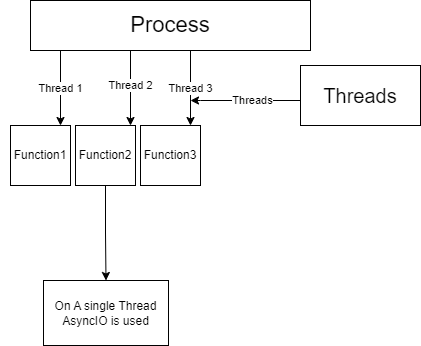

# Parallel-Programing in Python.
Hi All this repo is dedicated to explain the concepts of parallel programming in python. 
Python is an interpreted language and so it does execute line by line.

It has a GIL  (**Global Interpreter Lock**) which allows only one thread to be executed at a time.
Then how is parallel programming is possible in python.

One question that lead me to Create this repo is "What is the difference between Async Await and Multi-Threading?"
I was not able to answer that question that time so i decided to clear this doubt for all the people who are yet to study and who are not able to find the answer.

There are 3 folder which i have created named on the Concept itself:
- [AsyncIO](AsyncIO/asyncIO.md) 
- [Threading](MultiThreading\Threading.md)
- [Multi-Processing.](MultiProcessing\Multiprocessing.md)

In Actual only Multi-Processing will do parallel processing. It will overide the GIL and it will depend on the Hardware core of the system.
Each machines have core (Process) which can perform work parallely. So , if we have multiple cores then more processes can work at the same time which will give faster results.

Still the question is un-answered. What is the difference between AsyncIO and Multi-Threading?
Well as to it was simple but the principal on which both of them are working is also same.  
**Difference**  
| Async Await | Multi-threading |    
| ----------- | ----------- |  
| Async Await works on a single thread. | MultiThreading works on Multiple threads. |  
| Async Await use Event Loop. | - |  

**Principal**  
Says that when a single thread is running and then it takes some time to preform it's work python will not wait for it to complete and start another thread. As soon as it goes to wait(perform some calculation or anything) new thread will start executing his work.

References which I took were:
GFG
Google
ChatGPT.

**One More thing i would like to say it to play with the code if you truely wants to understand the logic behind. Change values add more timeouts, more functions and you will start to see the clear picture.**

The hierarchy of processes, threads, and async/await in Python represents different levels of concurrency and parallelism, with processes being the highest level, followed by threads within processes, and async/await providing a mechanism for asynchronous programming within threads. Each level offers different trade-offs in terms of resource usage, scalability, and complexity.

