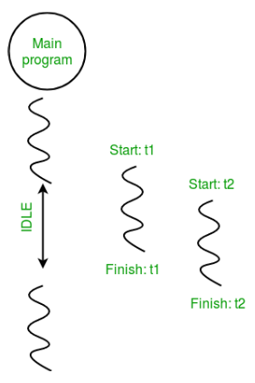

## Multi Threading in Python

- thread is simply a subset of a process!
- In simple words, a thread is a sequence of such instructions within a program that can be executed independently of other code.

# A thread contains all this information in a Thread Control Block (TCB)
- Thread Identifier: Unique id (TID) is assigned to every new thread
- Stack pointer: Points to the thread’s stack in the process. The stack contains the local variables under the thread’s scope.
- Program counter: a register that stores the address of the instruction currently being executed by a thread.
- Thread state: can be running, ready, waiting, starting, or done.
- Thread’s register set: registers assigned to thread for computations.
- Parent process Pointer: A pointer to the Process control block (PCB) of the process that the thread lives on.


- **Multithreading is defined as the ability of a processor to execute multiple threads concurrently**. 
In a simple, single-core CPU, it is achieved using frequent switching between threads. This is termed **context switching**. 
- In context switching, the state of a thread is saved and the state of another thread is loaded whenever any interrupt (due to I/O or manually set) takes place. Context switching takes place so frequently that all the threads appear to be running parallelly (this is termed multitasking).

**In simple words when there is a timeout(There is time taken) in any thread then another thread is taken to run. Code in the folder show the same.**

- Import module.
```python
import threading
```

- Create a Thread
To create a new thread, we create an object of the Thread class. It takes the ‘target’ and ‘args’ as the parameters. The target is the function to be executed by the thread whereas the args is the arguments to be passed to the target function.

```python
t1 = threading.Thread(target, args)
t2 = threading.Thread(target, args)
```

- Start a Thread
To start a thread, we use the start() method of the Thread class.
```python
t1.start()
t2.start()
```

- End the thread Execution
Once the threads start, the current program (you can think of it like a main thread) also keeps on executing. In order to stop the execution of the current program until a thread is complete, we use the join() method.
```python
t1.join()
t2.join()
```

```python
import threading


def print_cube(num):
	print("Cube: {}" .format(num * num * num))


def print_square(num):
	print("Square: {}" .format(num * num))


if __name__ =="__main__":
	t1 = threading.Thread(target=print_square, args=(10,))
	t2 = threading.Thread(target=print_cube, args=(10,))

	t1.start()
	t2.start()

	t1.join()
	t2.join()

	print("Done!")

```

